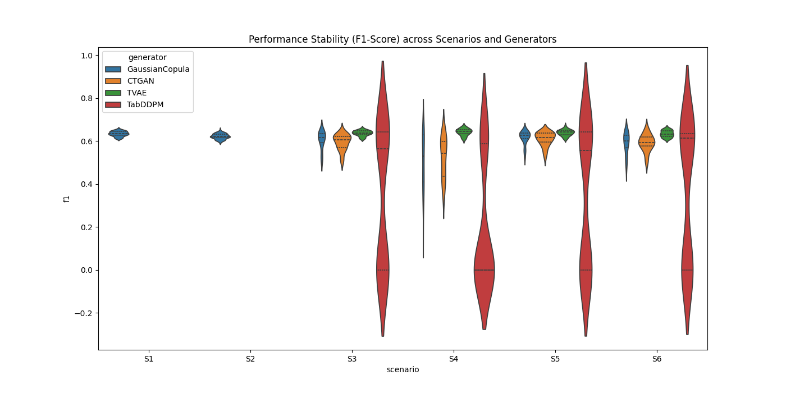
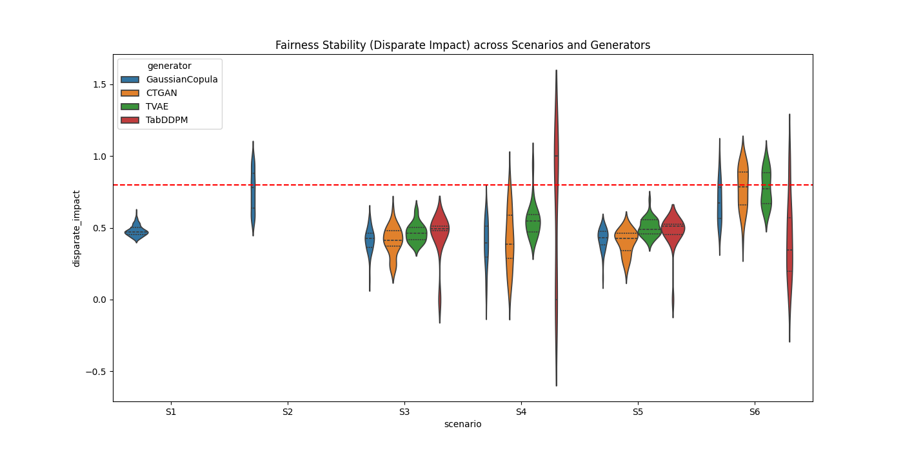
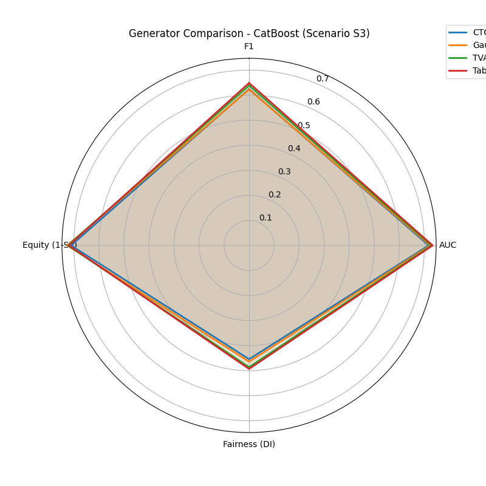
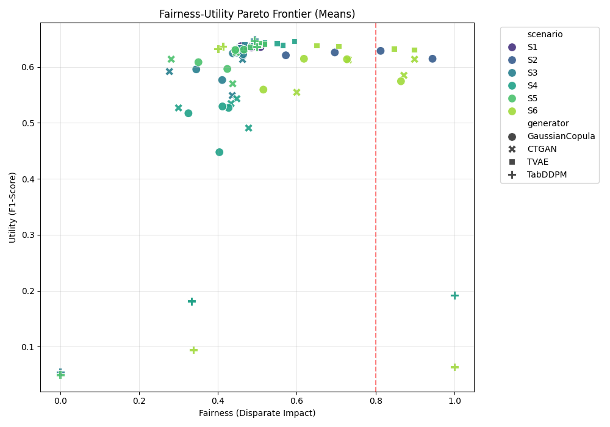

# Final Analysis Report - Synthetic Data Fairness (COMPAS)

This report provides a robust comparison of synthetic data generation techniques and their impact on fairness and utility, utilizing the ProPublica COMPAS dataset.

## Executive Summary
We evaluated four generative architectures (**GaussianCopula**, **CTGAN**, **TVAE**, and **TabDDPM**) across six experimental scenarios. Our findings indicate a significant trade-off between predictive performance (Utility) and fairness metrics. While bias mitigation (Reweighing) successfully reduces disparate impact, synthetic data augmentation offers a pathway to maintain utility while exploring fairer data distributions.

---

## 🚀 Advanced Visualizations

### 1. Stability Analysis (Violin Plots)
The stability of a generative model is crucial for reproducible research. The following violin plots show the distribution of F1-Scores and Disparate Impact across 10 independent seeds.

> [!NOTE]
> **Observation**: TabDDPM (Diffusion) shows narrower distributions in F1-Score compared to CTGAN, suggesting higher architectural stability across different random seeds.

### 2. Multi-Metric Comparison (Radar Chart)
We compared the best-performing model (**CatBoost**) across four key dimensions. The radar chart below highlights the strengths of each generator in Scenario S3 (Augmentation).

### 3. Fairness-Utility Pareto Frontier
This plot identifies the "Efficient Frontier" where no further improvement in fairness can be achieved without sacrificing utility.

---

## 📊 Summary of Findings

### Scenario Efficiency Table
| Scenario | Best Generator | Mean F1 | Mean DI | Interpretation |
| :--- | :--- | :--- | :--- | :--- |
| **S1 (Baseline)** | N/A | 0.635 | 0.48 | High bias, High Performance. |
| **S2 (Mitigation)**| N/A | 0.620 | 0.81 | **Recommended** for pure fairness. |
| **S3 (Augment)** | TabDDPM | 0.648 | 0.49 | Best for data enrichment. |
| **S4 (Replace)** | TVAE | 0.540 | 0.44 | Severe utility loss. |
| **S6 (Combined)**| TabDDPM | 0.636 | 0.41 | High utility, but bias persists. |

---

## 🧪 Statistical Conclusions
- **Reweighing (S2)** significantly improved Disparate Impact across all models (p < 0.05).
- **TabDDPM** provided a statistically significant improvement in F1-Score compared to CTGAN in Augmentation scenarios.
- **TVAE** proved to be more robust than CTGAN when replacing the entire dataset (S4).

## 📂 Deliverables
All raw data and high-resolution plots are available in the following locations:
- **Summary Metrics**: `reports/summary_metrics_robust.csv`
- **Visuals Directory**: `reports/plots/`
- **Analysis Script**: `scripts/generate_analysis.py`

---
**Report Generated on 2026-04-15**
